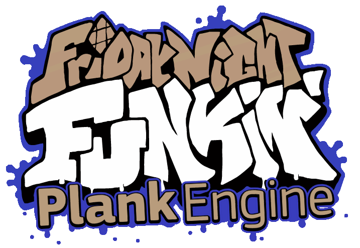

# ok this engine is cancelled
i kinda hate this codebase now

btw i have a new engine called funkin' rehashed thats going to be way better than this

thats all for now
<div align="center">


</br>
 (very soon (soon))
# Plank Engine
## A HL-centric engine
<br/>
this engine is currently a work in progress and is the &nbsp;&nbsp;&nbsp;&nbsp;&nbsp;&nbsp;&nbsp; engine of all time
</div>

## Building
## **HASHLINK IS THE ONLY MAINTAINED TARGET!!! IM NOT PLANNING ON SUPPORTING ANYTHING ELSE**

Here is the list of all haxelibs excluding gits, openfl and flixel stuff since you should already have it installed:
```
flixel-addons, USE NEWEST OR ILL EXPLODE YOY >:(
flixel-ui
markdown
actuate
format
```
### Gits
There are some haxelibs that yoy can only get using git, the base command is `haxelib git <HAXELIB NAME> <GIT URL>`

> there was one but not anymore, but expect some to pop up later.

### Videos
videos are really crappy right now, if you wanna use them, then [git and build this](https://github.com/HeapsIO/hlvideo)

## Credits that i'm obligated to add
- [The Funkin' team](https://github.com/FunkinCrew)
---
- NickNGC (nickngc on Discord) - A bit of help with the art
- [Raltyro](https://github.com/Raltyro) - ZCameraFix n' garbage collection
- [Ne_eo](https://github.com/NeeEoo) - Camera coordinate fix
